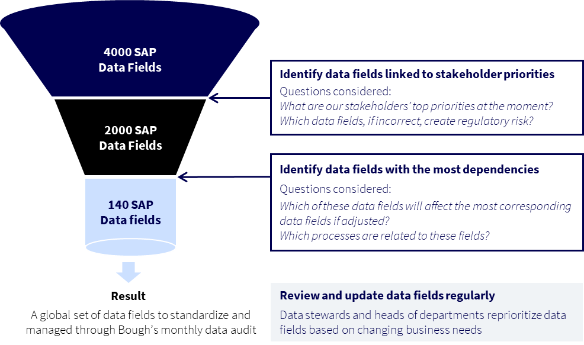
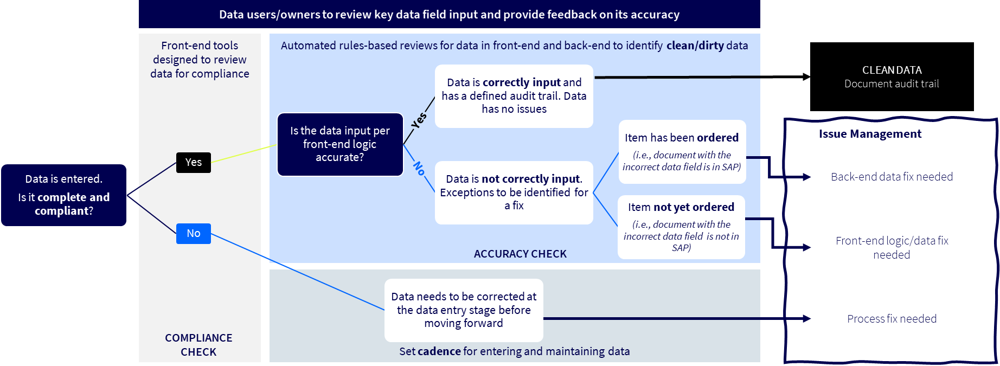
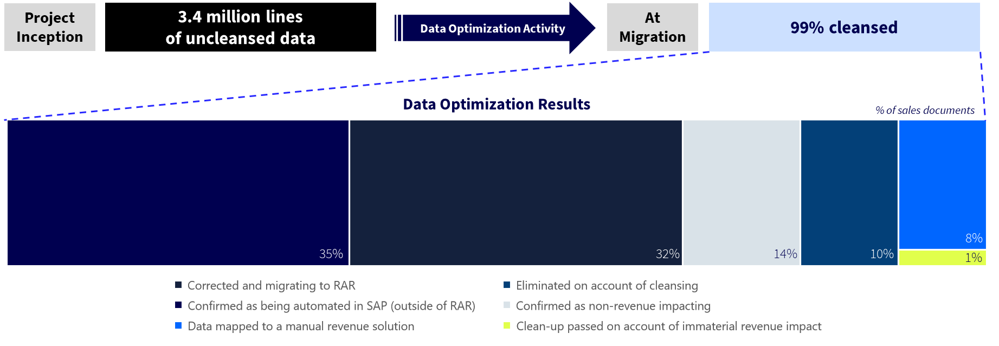
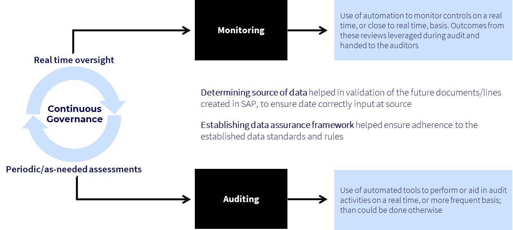

# **CASE STUDY 1 -- Data optimization and governance**

## Headline

Delivering better insights with better data

## At a glance

Bough helps a global technology company implement an effective data
governance program to support data migration for SAP RAR implementation
and ongoing business operations

## What we did

-   Revenue data management

-   Drive data literacy and accountability

-   Review pain-points and determine root cause of data quality issues

-   Implement data controls

-   Automated data stewardship platform implementation

## Case story

### Treading unchartered waters

Operating in over 60 countries and supported by 9,000 employees, this
leading technology and communications company hadn't prioritized Data
Quality and Master Data Management as part of its business information
management strategy. As a result, its data quality had degraded over
time, resulting in a variety of issues.

For example, inconsistent product categorization adversely impacted
accuracy of revenue recognition treatment, while challenges with
customer data resulted in manual accounting rework. Additionally,
obsolete data in its systems required extensive labor to monitor,
maintain, and action.

### Background and challenge

The company was looking to implement SAP RAR, an automated revenue
recognition and accounting solution. Yet, significant data challenges,
both known and unknown, emerged as the primary obstacle. As a result,
the company needed immediate help in identifying and addressing their
data quality issues.

To combat inaccurate, inconsistent, and out-of-date data, the client
needed to overhaul how it defined, measured, and maintained data quality
within its various revenue data impacting systems. There was a need to:
drive data accountability, document data definitions, standards and
metrics to measure data quality; review existing pain-points and
determine the root cause of data quality issues; and assist business
teams in troubleshooting accounting issues caused due to bad data

### Solution

To make standardizing and optimizing data fields in the global revenue
platform manageable, we prioritized small number of data fields based on
their degree of impact and importance to business priorities. We
compiled data and process maps to help data producers and owners fix
data and prevent errors going forward

#### STAGE 1 - Pre-migration data optimization

-   Analyzed the entire migration data dump

-   Evaluated quality and stability of the data being moved

-   Defined various inclusion / exclusion criteria based on SAP RAR data
    quality requirements

-   Evaluated and categorized each line item per the devised data
    categorization criteria

-   Identified and corrected issues

**Figure 1**

**Filtering out the noise through a tiered process to focus on the key
data fields**

{width="6.573611111111111in"
height="3.8868055555555556in"}

#### STAGE 2 -- Migration data readiness

-   Determined what data to move, and the quality of that data before
    and after the move

-   Enabled a solid migration baselining and stakeholder confidence on
    the go-live

-   Optimized 99% data to increase precision of SAP RAR results

-   Reconciled balances between legacy and new reporting systems.
    Investigated underlying causes for differences identified and
    suggested appropriate accounting treatment

#### STAGE 3 - Ongoing data governance

-   Established a strong data quality rules management and monitoring
    process

-   Structured root cause analysis to identify and address underlying
    causes of a problem and prevent future bad data

-   Built new processes and controls to achieve compliance and provide
    assurance over data flowing into SAP RAR

-   Deployed Alteryx and RPA managed solutions to monitor data quality
    (next to real time data governance)

**Figure 2**

**Illustrative workflow data quality rules to assess data from its point
of creation and appropriately categorize it for governance
purposes**{width="6.219192913385827in"
height="2.2766940069991253in"}Results

Data optimization efforts resulted in 99% of SAP records being analyzed
and optimized for either transitioning to SAP RAR in an accurate and
consistent manner or management through an alternate solution

**Figure 3**

**Data optimization results**

{width="6.3675in" height="2.2041896325459316in"}

Not only was the client successful in alleviating their data quality
pain points to meet their SAP RAR migration objectives, but also in
establishing a strong foundation to perform more advanced data
governance practices:

-   **Improved data quality** for SAP RAR migration

-   **Deployed an automated too**l to direct revenue data to its
    appropriate accounting solution

-   **Developed business acumen** in staff to ensure data input quality

-   **Implemented a data stewardship platform** to provide real-time
    insights on data quality

**Figure 4**

**Providing adequate assurance through continuous monitoring and regular
audits**

{width="5.743010717410324in"
height="2.5898884514435694in"}
